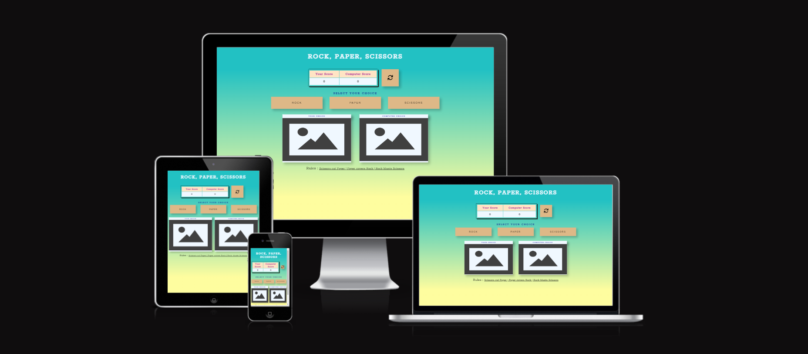

# Rock, Paper, Scissors

This is a hand game orginated in China, ushally participate two people and it is a fun game.It has three possible outcomes: a draw, a win or a loss. A player who decides to play rock will beat another player who has chosen scissors ("rock crushes scissor) but will lose to one who has played paper ("paper covers rock"), a play of paper will lose to a play of scissors ("scissors cuts paper"). If both players choose the same shape, the game is tied

# Business goals of the website 
This website is developed as part of the second project in diploma in Software Development from The Code Institute and this project mainly focued on the interactive section ie java script and responsiveness.

The Live Game can be accessed [HERE!](https://bijokmathew.github.io/Rock-Paper-Scissors/)
 

## Table of Contents
- [Rock, Paper, Scissors](#rock-paperscissors)
- [Business goals of the website](#business-goals-of-the-website)
  - [Table of Contents](#table-of-contents)
  - [UX](#ux)
    - [Strategy](#strategy)
    - [User Stories](#user-stories)
      - [Existing Members](#existing-members)
      - [New Users](#new-users)
    - [User Goals](#user-goals)
    - [Scope](#scope)
    - [Design](#design)
      - [Typography](#typography)
      - [Images](#images)
    - [Wireframes](#wireframes)
  - [Features](#features)
    - [Existing Features](#existing-features)
    - [Future Features](#future-features)
  - [Technologies used](#technologies-used)
  - [UX Stories Testing](#ux-stories-testing)
    - [Bugs](#bugs)
    - [Validator Testing](#validator-testing)
  - [Development and Deployment](#development-and-deployment)
    - [Using GitHub Pages](#using-github-pages)
    - [How to Fork it](#how-to-fork-it)
    - [How to Clone it](#how-to-clone-it)
    - [Making a Local Clone](#making-a-local-clone)
  - [Content](#content)
  - [Media](#media)
  - [Credits](#credits)
    - [For code inspiration, design inputs, help and advice. Many thanks to:](#for-code-inspiration-design-inputs-help-and-advice-many-thanks-to)
    - [Great sources](#great-sources)

## UX

### Strategy

This Game is ment for:

 - Fun activity 
 - Playing with computer
 - To avoid stress
 - As the rules are easy, kids can enjoy
 - Any age person can enjoy the game 

What user looking for?
 - Easy to understand the game rules
 - Easy to play using the button
 - Scores and message should be clear who is wining
 - Player selection and computer selection should be clear
 - Player want to go for next level
 - Player wanr option to enter their name on the score board

  Based on all the above requirements, built the game in such a way that 
    - Control buttons are clear and easy to use
    - Present the game rules as simple in a single line 
    - Computer and player score is clearly visible 
    - Display the message that who won and why

### User Stories

#### Existing Members

 - As a Member: I want to play the game easily
 - As a Member: Need to go for next level
 - As a Member: I wan to see who won and why
 - As a member: I want more options to play 

#### New Users

 - As a new User: I want to know how to play the game.
 - As a new User: I want to the look and feel of the game should be simple.
 - As a new User: I want to share the score using social medias .

### User Goals

 - Easy to use the game by using control buttons
 - Rules should be clear and concise information to the player 
 - Score and message should be visible to the player

### Scope
Rock, paper, scissors is a game website that aims to explain how pure JavaScript works with DOM. The objective is to build a fun, interactive website for individuals of all ages.

Users may play a fun and exciting game of Rock, Paper, Scissors against the computer and after each round, they will clearly know who won and got the point.

### Design
 Rock Paper Scisssors project's design has been influenced by the ”Portfolio Project 2 Scope” and "Love Maths" - projects.
 My design of the project's html, css influenced by my previous project "Tips For Esay Life" and "Love Running" projects .

 Main aim is to create a interactive clean looking website where there is a balance between colors, images and functionality.

 Rock Paper Scisssors is a single page game website has header, score, control buttons, computer and user choice image areas and finally rule sections. 'Refresh' button is used to reset the back to start mode. 
  
#### Typography

The [Google Font Open Sans]('https://fonts.googleapis.com/css2?family=Rokkitt&display=swap')was chosen as the main font with a fallback of Sans-Serif. Font weights of 600, 800 and 900 has been used on the website.

#### Images

Images has been chosen in accordance to colour and content. The purpose of the website is to give a friendly look and express quality. Images has been sized in order to match design.

### Wireframes

- Desktop

- Tablet

- Mobile

[Back to top](#rock-paper-scissors)

## Features 

Rock Paper Scissor is a single page game website that consists of these sections:

 - Header (Game title)
 - Summary section which has user and computer score section and 'reset' button 
 - Control section which has three buttons to control games
 - Message section  
 - Image area which has two part user selection and computer selection image area
 - Rule section

### Existing Features

 Header section 

The Header at the top of the page features a contrasting font that makes it stand out and prominently displays the game's title.

 The Rules, Reset button and Score section 

- Scores area:

The player's score is on the left, increasing after each player's win.
The right shows the computer's score, which also updates after each win.

- Reset button:
  
When clicked, it resets the scores to 0 and removes the choices and the result from the game area.

 Control section 

The control section contains the game options that the player can select: Rock, Paper and Scissors.
The computer generate an automatic random play when the player clicks on any of the above button.

Each button also includes a hoover and an active element for the assistance of users.

 Result message section 

The winning decision based on the game's rules is also displayed after each round.
It's also beneficial for new users because they can learn the game's rules while they play.

 User vs Computer selection section 

The left box displays the player's choice, while the right box displays the computers. This facilitates comparison.

The chosen option displays a humorous picture of the real choice.

 The Rules section 

The Rule section gives an overview of the game rules.

### Future Features

- To add different level for the game and more options.
- To ensure return and new visitors by sharing their high scores or victories on social media.
- To storea player name and their higher score
  
[Back to top](#rock-paper-scissors)

## Technologies used

- [HTML](https://en.wikipedia.org/wiki/HTML)
- [CSS](https://en.wikipedia.org/wiki/CSS)
- JavaScript: To create an interactive game that allows users to interact with data.
- Font Awesome - Used to provide in the Hacks section and also in the Footer.
- Chrome Dev Tools - Used to check my work periodically, debug my code when needed and also test the responsiveness of my website.
- GitHub - Used to store my code after pushing from Gitpod.
- GitPod - Used as a development environment.
- Git - Used for version control of my code.
- Balsamic- Used to create the wireframes for the project.
- Google Fonts - Used to style my website fonts.
- W3C Markup Validation Service - Used to validate all of my HTML code.
- W3C CSS Validation Service - Used to validate all of my CSS code.
- Optimizilla Image Compressor - Used to compress the images.
- Dirty Markup Formatter - Used to standardise and format my HTML and CSS code.
  
## UX Stories Testing 

Below are website images for reference with the UX Stories Testing.

1. As a new visitor, I want to know how to play the game.

    - The user can see the game rules always on rules area on the bottum side.
    - The user can see all the control button and it is a self explanatory.

2. As a new user, I want to know the scores of the game.

    - The user can see the player's and computer score after each game.

3. As a repeat visitor, I want to restart the game at some point.

    - The user can use 'reset' button.
    - After selecting the 'reset' button it clears the scores and message area.
    - In the future I would like to add an option to change the levels of game.

4. As a repeat visitor, I want to see message who won and why .

    - Message section clearly display who won the game and reason after each play
   
5. As a user, I want to see the player and computer selections
   - Image display choice section with respective label like user and computer choice   
     display the user selected and computer choice.
  
[Back to top](#Easy-Life-Tips)

### Bugs 

During the development stage, found many minor and major issues .The following bugs took time to resolve.

1. During Responsive test case, 
2. 
 
### Validator Testing 

At each stage of the wesite development various types testing was executed to find the issues by using using Chrom Dev Tools.
After the completed version of the website, used three forms of validations to verify the code stability. Also carried out the responsive test for different screen resolution by using chrome tool. 

- HTML
  - No errors were returned when passing through the official [W3C Validator](https://validator.w3.org/nu/?doc=https%3A%2F%2Fbijokmathew.github.io%2FRock-Paper-Scissors%2F)

- CSS
  - No errors were returned when passing through the official [(Jigsaw validator)](https://jigsaw.w3.org/css-validator/validator?uri=https%3A%2F%2Fbijokmathew.github.io%2Ftips-for-easylife%2F&profile=css3svg&usermedium=all&warning=1&vextwarning=&lang=en)

- Lighthouse testing

- Java script
  - JavaScript was tested using [Beautifytools](https://beautifytools.com/javascript-validator.php).
  

[Back to top](#rock-paper-scissors)

## Development and Deployment

The development environment used for this project is GitPod and also used github version control tool to stote the project.Github help to keep track each version and easily track the changes made to the source code. The GitPod environment was created using a template provided by Code Institute.

The live version of the project is deployed at GitHub pages.

### Using GitHub Pages
In the GitHub Repository from the project https://github.com/bijokmathew/Rock-Paper-Scissors 

1. Click the 'Settings' Tab.
2. Scroll Down to the Git Hub Pages Heading.
3. Select 'Main Branch' as the source.
4. The Page will reload 'Settings' again.
5. Scroll to GitHub pages heading and there will now be a clickable link https://bijokmathew.github.io/Rock-Paper-Scissors/
6. Click the link for the live deployed page.

### How to Fork it
1. On GitHub, go to [rock-paper-scissors](https://github.com/bijokmathew/Rock-Paper-Scissors).
2. In the top right, click "Fork".

### How to Clone it
1. Go to the main page of the repository.
3. Above the file list, click "Code".
4. Select HTTPS, SSH, or GitHub CLI and then click copy to clone it.
5. Open Git Bash.
6. Change the location of your cloned repository.
7. Type `git clone` and then paste the URL you copied.
8. Press “Enter” to create your clone.

### Making a Local Clone
1. Locate the [Repository](https://github.com/bijokmathew/Rock-Paper-Scissors).
2. Select Clone or Download from tab "Code".
3. Copy the Git URL from the dialogue box.
4. Open a terminal window and go to specific directory.
5. Change the location to where you want the cloned directory to be.
6. Type `git clone`, and then paste the URL you copied.
7. Press Enter, and your local clone will be created.

[Back to top](#rock-paper-scissors)
## Content 

All content for the website taken from  Google and Wikipedia

## Media

- All Icons used are from FontAwesome (https://fontawesome.com/)

- All images used in the website were found on [Freepik](https://www.freepik.com/free-vector)

## Credits 

### For code inspiration, design inputs, help and advice. Many thanks to:

Martina Terlevic
 - My mentor at Code Institute and she guided me throught the project.
 - Friends and Teachers at Code Institute: Thank you for all your knowledge and insight.
 - Walkthrough project ”Love Maths” and "Portfolio Project Scope" has provided  inspiration and knowledge.

### Great sources

Sites that has provided me with knowledge and information that has been vital to this project:

- https://www.w3schools.com/
- https://stackoverflow.com
- https://learn.codeinstitute.net/dashboard 
- https://www.youtube.com
- Flexbox: [A Complete Guide to Flexbox](https://css-tricks.com/snippets/css/a-guide-to-flexbox/)
- Body background gradient: [ColorSpace](https://mycolor.space/)
     

Top screenshot in this ReadMe was made using:

http://ami.responsivedesign.is/

Best regards

[Back to top](#rock-paper-scissors)

